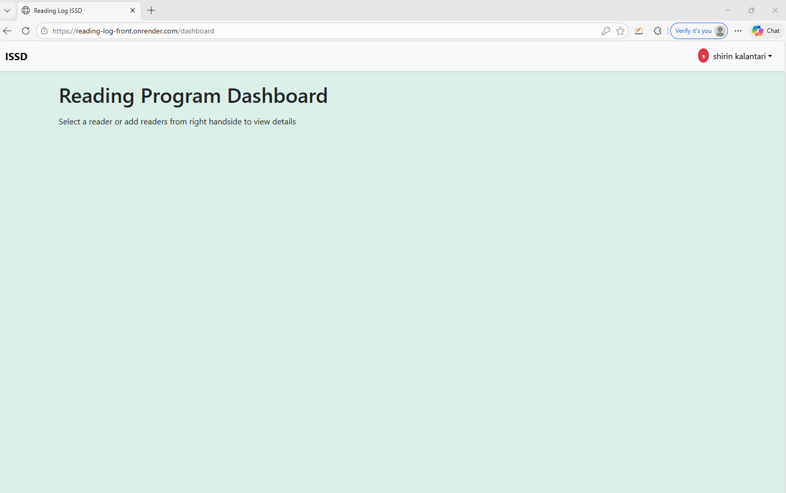
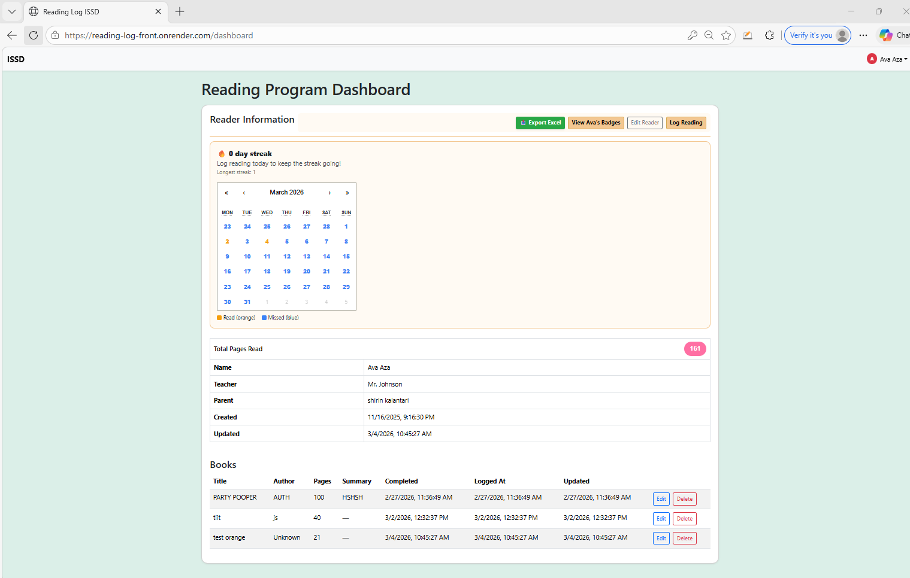
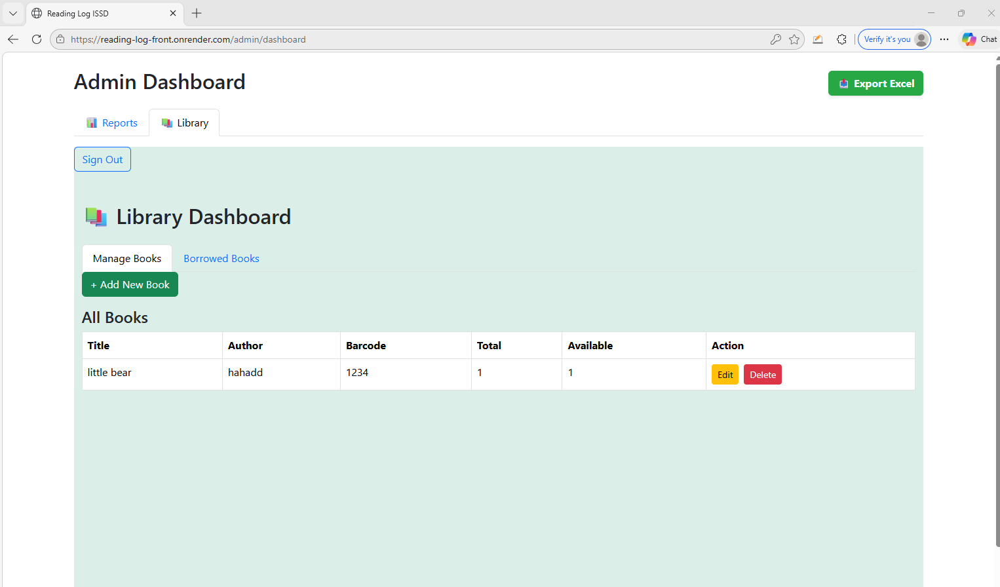

# Reading Log App

## Overview
The Reading Log App is a full-stack web application designed to help families and schools track student reading activity. It supports parent and admin workflows, reader profiles, reading logs, progress tracking, badges, and dashboard-based features.

## Purpose
This project was built to make reading progress easier to manage and more engaging for both parents and students. It also provides a structured way to log books, monitor pages read, and display progress visually.

## My Role
I designed and developed the application structure, worked on both frontend and backend functionality, handled dashboard logic, implemented reader and reading log features, and worked on deployment and debugging.

## Tech Stack
- React
- JavaScript
- Bootstrap
- Node.js
- Express
- MongoDB
- MongoDB Atlas
- Render

## Key Features
- Parent and admin login
- Reader profile management
- Book logging and reading history
- Dashboard with total pages read
- Badge display
- Export to Excel
- Reading streak calendar
- Email reminder functionality
- Responsive interface

## Screenshots
Screenshots for this project are available in the `screenshots` folder.
## Sample Screens

### Dashboard

### Reader Information

### Admin Dashboard

## Architecture / Workflow
This project uses a React frontend connected to a Node.js/Express API with MongoDB as the database.

Example flow:
- Parent logs in
- Selects a reader
- Logs reading activity
- Dashboard updates pages and reading history
- Reminder system checks activity and sends notifications

## Challenges and Solutions
### Challenge 1: Managing protected routes and dashboard state
I worked through authentication flow, token handling, and reader selection to keep the dashboard stable and user-specific.

### Challenge 2: Tracking reading activity over time
I implemented logic to use logged reading entries to calculate streaks and support reminder workflows.

### Challenge 3: Deployment and environment setup
I connected the project to Render and MongoDB Atlas, handled environment variables, and debugged issues where local and deployed versions behaved differently.

## Live Demo
Add your live demo link here

## Future Improvements
- SMS reminder support
- Parent notification preferences
- Improved analytics and reports
- More polished visual dashboard cards
- Teacher-specific tools if expanded

## Folder Contents
- `screenshots/` → UI screenshots
- `gifs/` → short feature demos
- `diagrams/` → architecture or workflow diagrams